# terraform-gcp-spanner

Production-ready Terraform module for Google Cloud Spanner. Manages instances (regional and multi-region), databases with DDL, autoscaling, CMEK encryption, backup schedules, point-in-time recovery, and IAM bindings.

## Architecture

```mermaid
flowchart TD
    A[Terraform Module] --> B[Spanner Instances]
    A --> C[Spanner Databases]
    A --> D[Backup Schedules]
    A --> E[IAM Bindings]

    B --> B1[Regional Config]
    B --> B2[Multi-Region Config]
    B --> B3[Autoscaling]
    B --> B4[Processing Units / Nodes]
    C --> C1[DDL Statements]
    C --> C2[CMEK Encryption]
    C --> C3[Point-in-Time Recovery]
    C --> C4[PostgreSQL Dialect]
    C --> C5[Drop Protection]
    D --> D1[Cron Schedule]
    D --> D2[Retention Period]
    D --> D3[Encrypted Backups]
    E --> E1[Instance IAM]
    E --> E2[Database IAM]
    E --> E3[Conditional Access]

    style A fill:#4285F4,stroke:#1A73E8,color:#fff
    style B fill:#34A853,stroke:#1E8E3E,color:#fff
    style C fill:#EA4335,stroke:#D93025,color:#fff
    style D fill:#FBBC04,stroke:#F9AB00,color:#333
    style E fill:#9C27B0,stroke:#7B1FA2,color:#fff
    style B1 fill:#81C784,stroke:#66BB6A,color:#333
    style B2 fill:#81C784,stroke:#66BB6A,color:#333
    style B3 fill:#A5D6A7,stroke:#81C784,color:#333
    style B4 fill:#A5D6A7,stroke:#81C784,color:#333
    style C1 fill:#EF9A9A,stroke:#EF5350,color:#333
    style C2 fill:#EF9A9A,stroke:#EF5350,color:#333
    style C3 fill:#EF9A9A,stroke:#EF5350,color:#333
    style C4 fill:#EF9A9A,stroke:#EF5350,color:#333
    style C5 fill:#EF9A9A,stroke:#EF5350,color:#333
    style D1 fill:#FFF176,stroke:#FDD835,color:#333
    style D2 fill:#FFF176,stroke:#FDD835,color:#333
    style D3 fill:#FFF176,stroke:#FDD835,color:#333
    style E1 fill:#CE93D8,stroke:#BA68C8,color:#333
    style E2 fill:#CE93D8,stroke:#BA68C8,color:#333
    style E3 fill:#CE93D8,stroke:#BA68C8,color:#333
```



## Usage

```hcl
module "spanner" {
  source = "path/to/terraform-gcp-spanner"

  project_id = "my-gcp-project"

  instances = {
    "my-instance" = {
      display_name = "My Spanner Instance"
      config       = "regional-us-central1"
      num_nodes    = 1
    }
  }

  databases = {
    "my-database" = {
      instance = "my-instance"
      ddl = [
        "CREATE TABLE Users (UserId INT64 NOT NULL, Name STRING(256)) PRIMARY KEY(UserId)",
      ]
    }
  }
}
```

## Features

- Instance provisioning with regional and multi-region configurations
- Autoscaling with CPU and storage utilization targets
- Fixed capacity via processing units or node count
- Database creation with DDL statement management
- CMEK encryption for databases and backups
- Point-in-time recovery via version retention period
- PostgreSQL dialect support
- Backup schedules with cron expressions and retention policies
- Instance-level and database-level IAM bindings with conditional access
- Drop protection and deletion protection for databases

## Requirements

| Name | Version |
|------|---------|
| terraform | >= 1.3.0 |
| google | >= 5.0 |
| google-beta | >= 5.0 |

## Inputs

| Name | Description | Type | Required |
|------|-------------|------|----------|
| project_id | GCP project ID | `string` | yes |
| labels | Common labels for all resources | `map(string)` | no |
| instances | Map of Spanner instances to create | `map(object)` | no |
| databases | Map of Spanner databases to create | `map(object)` | no |
| backup_schedules | Map of backup schedules | `map(object)` | no |
| instance_iam_bindings | Instance-level IAM bindings | `map(object)` | no |
| database_iam_bindings | Database-level IAM bindings | `map(object)` | no |

## Outputs

| Name | Description |
|------|-------------|
| instance_ids | Map of instance names to resource IDs |
| instance_names | Map of instance names to short names |
| instance_states | Map of instance names to current state |
| database_ids | Map of database names to resource IDs |
| database_names | Map of database names to short names |
| database_states | Map of database names to current state |
| backup_schedule_ids | Map of backup schedule names to resource IDs |
| project_id | The GCP project ID |

## Examples

- [Basic](examples/basic/) - Single-node regional instance with database and DDL
- [Advanced](examples/advanced/) - Autoscaling, CMEK, backup schedules
- [Complete](examples/complete/) - Multi-region, PostgreSQL, all IAM and backup features

## License

MIT License - see [LICENSE](LICENSE) for details.
